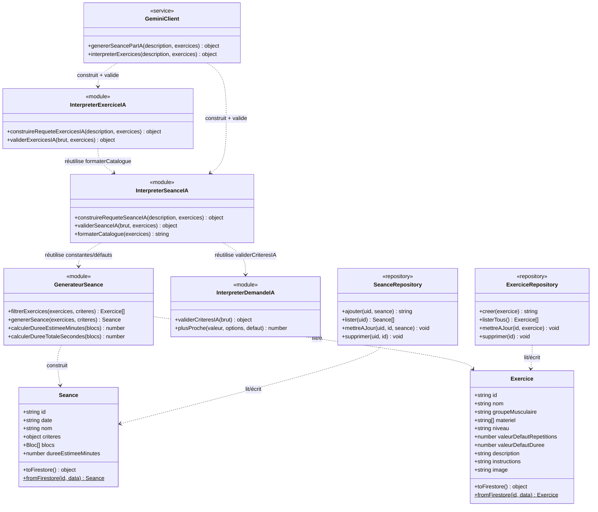
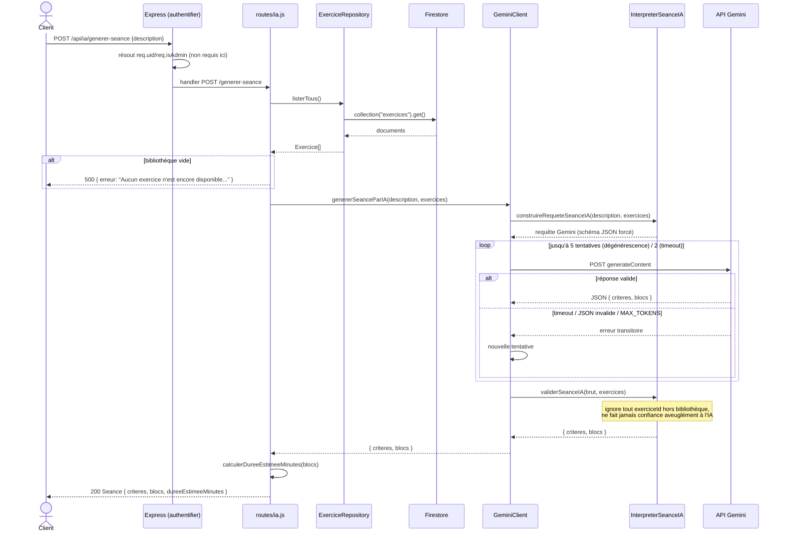

# Backend HomeFit

API REST Node/Express (ESM), seul point d'accès à Cloud Firestore (via `firebase-admin`, Admin
SDK) et à l'API Gemini. Contient toute la logique métier de l'application : sélection/génération
des exercices d'une séance, accès aux données, appel IA.

Pour la configuration (comptes Google, variables d'environnement, déploiement Cloud Run) : voir
[`GOOGLE.md`](../../GOOGLE.md) à la racine du dépôt. Pour les décisions d'architecture globales
(pourquoi un backend séparé, répartition front/backend) : voir [`CLAUDE.md`](../../CLAUDE.md).

## Vue d'ensemble

```
server.js
└── routes/          whoami, exercices, seances, ia
    └── middleware/   authentifier (résout req.uid/req.isAdmin), requireAdmin, requireUid
        └── domain/        logique pure (Exercice, Seance, GenerateurSeance, Interpreter*IA)
        └── repositories/  ExerciceRepository, SeanceRepository (Firestore)
        └── services/      GeminiClient (API Gemini)
```

Trois fichiers seulement touchent à Firebase Admin (`src/firebaseAdmin.js`, qui expose `db` et
`auth`) : `ExerciceRepository.js`, `SeanceRepository.js` (Firestore) et `middleware/auth.js`
(vérification des tokens). Tout le reste du backend ne connaît ni Express ni Firestore — les
fonctions de `src/domain/` reçoivent leurs données en paramètre et sont testables sans serveur
(voir `backend/tests/`).

## Diagramme de classes



**Notes** :
- `Exercice`/`Seance` sont de vraies classes ES ; les autres (`<<module>>`, `<<repository>>`,
  `<<service>>`) sont des objets exportant des fonctions — représentés comme des classes ici par
  convention de documentation, pas des `class` JS.
- `GenerateurSeance`, `InterpreterDemandeIA`, `InterpreterSeanceIA` et `InterpreterExerciceIA` sont
  entièrement dupliqués côté frontend (`public/utils/`, `public/models/`) — voir
  [`docs/frontend/README.md`](../frontend/README.md) et la section "Duplication assumée" de
  `CLAUDE.md`. Ce diagramme ne documente que la copie backend.

## Diagramme de séquence — `POST /api/ia/generer-seance`

Flux choisi car il traverse toutes les couches du backend (middleware, repository, domain,
service externe). Les routes CRUD simples (`/api/exercices`, `/api/seances`) suivent un schéma
plus court — route → repository → Firestore — sans étape intermédiaire.



## Tableau des routes

Toutes les routes passent par `authentifier` (mounté au niveau du préfixe dans `server.js`), qui
résout `req.uid`/`req.isAdmin` **sans jamais bloquer** — ce sont `requireAdmin`/`requireUid`,
posés route par route, qui imposent une exigence précise.

> ⚠️ Le gestionnaire d'erreur global (`server.js`) renvoie **toujours 500** pour toute erreur
> transmise via `next(err)`, quelle que soit sa nature métier — les seuls codes non-500 de toute
> l'API sont **401** (`authentifier`, token Firebase invalide), **403** (`requireAdmin`) et **400**
> (`requireUid`), levés directement par les middlewares.

### `GET /api/whoami`

| | |
|---|---|
| Middleware | `authentifier` |
| Body | — |
| Réponse | `200` `{ uid: string\|null, isAdmin: boolean }` |

### `/api/exercices`

| Route | Middleware | Body | Réponse succès | Erreurs |
|---|---|---|---|---|
| `GET /` | `authentifier` | — | `200` `Exercice[]` | — |
| `POST /` | `authentifier`, `requireAdmin` | champs `Exercice` (`nom`, `groupeMusculaire` requis) | `201` `{ id }` | `403` non admin |
| `PUT /:id` | `authentifier`, `requireAdmin` | champs `Exercice` (remplacement complet) | `204` | `403` non admin |
| `DELETE /:id` | `authentifier`, `requireAdmin` | — | `204` | `403` non admin |

### `/api/seances`

| Route | Middleware | Body | Réponse succès | Erreurs |
|---|---|---|---|---|
| `POST /generer` | `authentifier` (public) | `criteres` (`dureeMinutes`, `niveau`...) | `200` `Seance` | `500` si aucun exercice ne correspond aux critères |
| `POST /recalculer-duree` | `authentifier` (public) | `{ blocs }` | `200` `{ dureeEstimeeMinutes }` | — |
| `GET /` | `authentifier`, `requireUid` | — | `200` `Seance[]` (triées par date desc) | `400` uid non résolu |
| `POST /` | `authentifier`, `requireUid` | champs `Seance` | `201` `{ id }` | `400` uid non résolu |
| `PUT /:id` | `authentifier`, `requireUid` | champs `Seance` (remplacement complet) | `204` | `400` uid non résolu |
| `DELETE /:id` | `authentifier`, `requireUid` | — | `204` | `400` uid non résolu |

> `POST /generer` et `POST /recalculer-duree` sont déclarées **avant** `seancesRouter.use(requireUid)`
> dans le code — elles ne nécessitent donc pas d'utilisateur résolu, contrairement aux 4 routes
> suivantes.

### `/api/ia`

| Route | Middleware | Body | Réponse succès | Erreurs |
|---|---|---|---|---|
| `POST /generer-seance` | `authentifier` (public) | `{ description }` | `200` `Seance` | `500` bibliothèque vide, ou échec IA (après retries) |
| `POST /interpreter-exercices` | `authentifier`, `requireAdmin` | `{ description }` | `200` `{ nouveaux, existants }` | `403` non admin ; `500` si aucune proposition exploitable |

## Variables d'environnement

`PORT`, `FIREBASE_SERVICE_ACCOUNT_JSON`, `GEMINI_API_KEY`, `GEMINI_MODEL`, `STATIC_API_TOKEN`,
`ADMIN_EMAIL`, `CORS_ALLOWED_ORIGIN` — détail de chaque variable et où l'obtenir dans
[`GOOGLE.md`](../../GOOGLE.md#variables-denvironnement-backend-backendenv).

## Tests

Logique pure testée sans réseau ni Firestore dans `backend/tests/` (un fichier par module de
`src/domain/`) :

```bash
cd backend
npm run test:run
```
