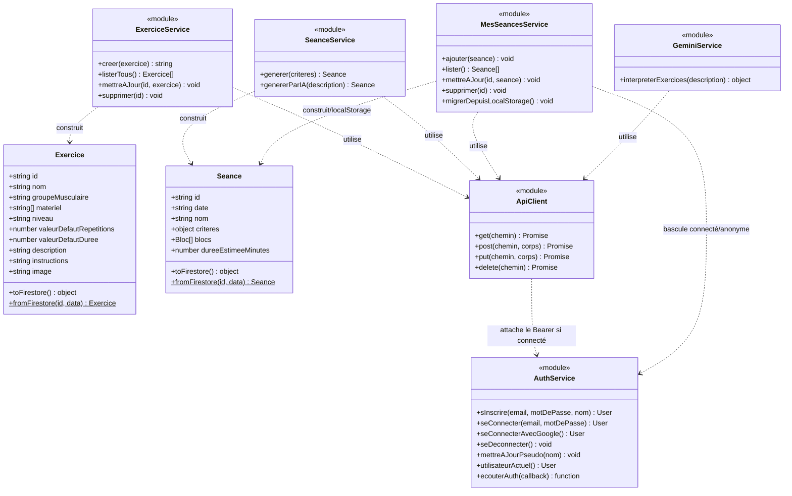
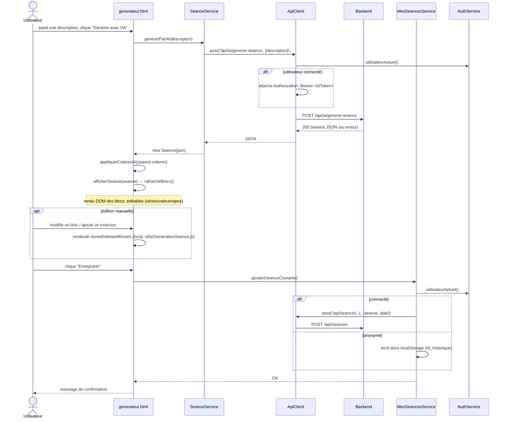

# Frontend HomeFit

Vanilla HTML/CSS/JS (pas de framework, pas de bundler), déployé sur Firebase Hosting (`public/`
est la racine servie). Le front est une pure couche d'interface : il affiche, collecte les entrées
utilisateur, et délègue toute décision métier au backend via `services/ApiClient.js`. Il ne parle
jamais directement à Firestore ni à l'API Gemini — uniquement à Firebase Auth (connexion) et au
backend (tout le reste).

Pour la répartition des responsabilités front/backend et les décisions d'architecture : voir
[`CLAUDE.md`](../../CLAUDE.md). Pour l'architecture backend (routes, couches) : voir
[`docs/backend/README.md`](../backend/README.md).

## Vue d'ensemble

```
pages (*.html)
└── services/    ApiClient (frontière réseau unique), ExerciceService, SeanceService,
                  MesSeancesService, AuthService, GeminiService
    └── models/       Exercice, Seance (copies du domaine backend, pour l'affichage)
    └── utils/        GenerateurSeance (recalcul de durée), ExecutionSeance, constantes, ModaleExercice
```

Les pages HTML ne sont pas des classes : elles orchestrent les services (import statique en haut
du `<script type="module">`, sauf `GeminiService` — importé dynamiquement à l'usage) et manipulent
le DOM directement. Aucune page ne contient de règle de décision (sélection/génération d'exercices,
accès aux données) — tout est délégué au backend via `ApiClient`.

## Diagramme de classes



**Notes** :
- Toutes les classes annotées `<<module>>` sont des objets exportés (pas de `class` JS) — chaque
  méthode listée est une fonction exportée de ce module.
- `Exercice`/`Seance` sont des **copies** des classes backend équivalentes (même forme,
  `toFirestore()`/`fromFirestore()` compris) — duplication assumée, voir `CLAUDE.md`.
- `utils/GenerateurSeance.js` (front) ne contient **que** `calculerDureeEstimeeMinutes()` — la
  vraie décision métier (`genererSeance()`, `filtrerExercices()`) est exclusivement backend, non
  représentée ici (voir le diagramme backend).

## Diagramme de séquence — "Décris ta séance" (`generateur.html`)

Choisi car il illustre le pattern général (page → service → `ApiClient` → backend, ce dernier
représenté en boîte noire — son détail est dans le diagramme backend) et couvre la bascule
connecté/anonyme de `MesSeancesService`.



## Tableau des pages

| Page | Imports principaux | Rôle |
|---|---|---|
| `index.html` | `AuthService` | Accueil : liens vers générateur/bibliothèque/mes séances/compte, adapte le lien "compte" à l'état de connexion |
| `generateur.html` | `ExerciceService`, `SeanceService`, `MesSeancesService`, `utils/GenerateurSeance` | Formulaire de critères ou description IA → séance générée (backend) → édition des blocs → enregistrement |
| `exercices.html` | `ExerciceService`, `AuthService` | Bibliothèque d'exercices en lecture seule, recherche et filtres |
| `mes-seances.html` | `MesSeancesService`, `ExerciceService` | Mes séances enregistrées : lancer/modifier/supprimer, export/import JSON |
| `execution.html` | `utils/ExecutionSeance`, `ExerciceService` | Écran d'exécution guidée (minuteur, enchaînement auto ou validation manuelle) |
| `admin.html` | `ExerciceService`, `GeminiService` (dynamique) | Import/export, ajout/modification/suppression manuelle ou via IA (1 à N exercices), réservé à `ADMIN_EMAIL` |
| `login.html` | `AuthService`, `MesSeancesService` | Connexion/inscription (email ou Google), migration des séances locales à la première connexion |

## Tests

Logique pure encore présente côté navigateur (aucune dépendance Firebase/`ApiClient`), testée à la
racine du dépôt :

```bash
npm run test:run
```

- `tests/GenerateurSeance.test.js` — `calculerDureeEstimeeMinutes` (recalcul local de durée)
- `tests/ExecutionSeance.test.js` — `construireEtapes` (aplatissement blocs × séries)
